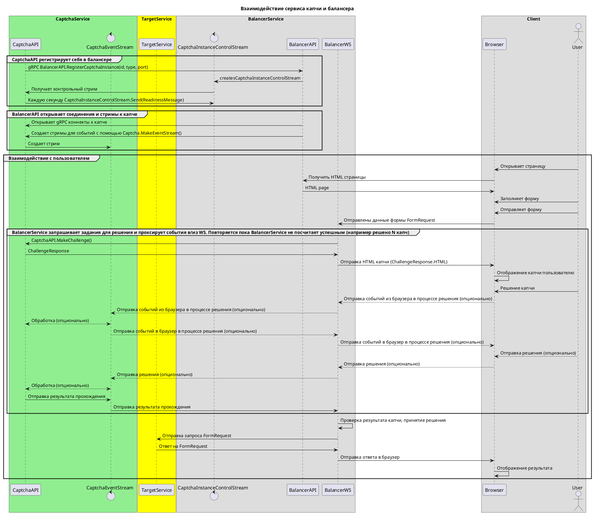

# Техническое задание на реализацию сервиса капчи

**Disclaimer:** Сейчас в работе песочница, которая реализуется под данные протоколы и требования, однако при наличии оснований возможно менять протоколы частично, но так, чтобы основная суть работы оставалась прежней


## Требования к капчам

### Пользовательские
1. **Должна быть максимально простой и понятной для человека** 
2. Очень желательно взаимодействие вроде перетаскивания/кнопрк/свайпов, т.к. простые сценарии уже давно генерируются
3. Как вариант - очень простой аналог онлайн игр, когда с клиента стрим событий клавиатуры, с сервера стрим данных для рендера картинки

### Технические
1. Задание генерируется и отдается клиенту в рантайме, чтобы не было возможности производить атаку по количеству имеющихся задач
2. Min 100rps на генерацию заданий с одного инстанса на современных cpu, например i9/M3/M4. Варианты с предварительной генерацией возможны, но нужно обсуждать отдельно и оценивать производительность.
3. Экономия памяти - задание сгенерили и отдали клиенту, запомнили только ответ для сравнения
4. П.3. не так актуален для капч вида игр, когда на сервере состояние которое меняем, но все равно стоит память экономить. Целевое потребление на 10к активных задач в процессе <= 8Gb
5. В первых простых версиях можно игнорировать complexity при запросе, но вообще чем выше, тем "злее" должа быть капча. Число от 0 до 100
## Сведения о интеграции

### Подключение к нашей системе

Ввиду необходимости иметь много разных капч и периодически их менять был выработан протокол подключения капчи к нашей системе

Подключение производится посредством реализации клиента и сервера grpc.

При запуске сервис капчи ищет для своего апи первый не занятый порт из диапазона os.env MIN_PORT и MAX_PORT (defualt 38000-40000).

Клиент подключается к балансеру и сообщает, на каком хосте и порту запущена капча. 
После этого балансер добавляет ее себе в список, открывает подключения и может запрашивать челленджи - сами задания на решение.

Это позволяет перезапускать через запуск новых инстансов при том старые будут висеть до graceful shutdown (MAX_SHUTDOWN_INTERVAL default 600 sec).
При остановке отправляет событие STOPPED в балансер, чтобы он не слал новые запросы.

### Работа капчи со стороны клиента

Челлендж представляет собой сообщение с id (uuid) и html, который будет запущен на фронте в iframe.
Html должен содержать сразу все целиком, включая js/css.

Сразу после загрузки html, в процессе решения капчи клиентом, ибо после отправки решения, js может отправлять события через ws родительского окна и также получать события с сервера. 

Например, таким образом возможно отправлять события кликов, а сервер решает, что можно заменить часть задания и присылает новое

Как отправка так и получение событий вебсокета недоступно напрямую, они получаются/отпарвляются через window.postMessage

Для отправки данных из JS капчи:
```js
window.top.postMessage({type:'captcha:sendData',data:new Date().toString()})
```

Для получения данных с сервера
```js
window.addEventListener("message", (e: MessageEvent) => {
    if (e.data?.type === "captcha:serverData") {
        // e.data.data
    }
})
```
Важно, чтобы данные отправлялись компактно, т.к. очень много клиентов с медленным соединением

Желательно отправлять данные в бинарном виде и ужимать насколько это возможно.
Например, для события клика можно взять что он произошел в максимальном размере координат 8192x8192 и уместить это с побитовым сдвигом в один инт вместе с еще какими-то данными.

Не так принципиально для обычных капч, но если что-то игровое со стримингом с сервера состояния и рендером на клиенте - на медленном соединении по другому не будет работать.

## Протоколы и схемы

### Общая sequence диаграмма работы капчи с нашей системой
Зеленым цветом подсвечена именно та область, которую передаем на разработку. 
Диаграмма немного не актуальна по названиям, но при этом основной смысл остался тот же.
Актуальные названия в прото файлах ниже



### BalancerV1.proto
```protobuf
syntax = "proto3";

package balancer.v1;
option go_package = "./pb/balancer/v1";

import "google/protobuf/timestamp.proto";

service BalancerService {
  rpc RegisterInstance(stream RegisterInstanceRequest) returns (stream RegisterInstanceResponse) {}
}

message RegisterInstanceRequest {
  enum EventType {
    UNKNOWN = 0;
    READY = 1;
    NOT_READY = 2;
    STOPPED = 3;
  }

  EventType event_type = 1;
  string instance_id = 2;
  string challenge_type = 3;
  string host = 4;
  int32 port_number = 5;
  int64 timestamp = 6;
}

message RegisterInstanceResponse {
  enum Status {
    SUCCESS = 0;
    ERROR = 1;
  }

  Status status = 1;
  string message = 3;
}
```

### CaptchaV1.proto

```protobuf
syntax = "proto3";

package captcha.v1;
option go_package = "./pb/captcha/v1";

service CaptchaService {
  rpc NewChallenge(ChallengeRequest) returns (ChallengeResponse) {}
  rpc MakeEventStream(stream ClientEvent) returns (stream ServerEvent) {}
}

message ChallengeRequest {
  int32 complexity = 1;
}

message ChallengeResponse {
  string challenge_id = 1;
  string html = 2;
}

message ClientEvent {
  enum EventType {
    FRONTEND_EVENT = 0;
    CONNECTION_CLOSED = 1;
    BALANCER_EVENT = 2;
  }

  EventType event_type = 1;
  string challenge_id = 2;
  bytes data = 3;
}

message ServerEvent {
  message ChallengeResult {
    string challenge_id = 1;
    int32 confidence_percent = 2;
  }

  message RunClientJS {
    string challenge_id = 1;
    string js_code = 2;
  }

  message SendClientData {
    string challenge_id = 1;
    bytes data = 2;
  }

  oneof event {
    ChallengeResult result = 1;
    RunClientJS client_js = 2;
    SendClientData client_data = 3;
  }
}
```